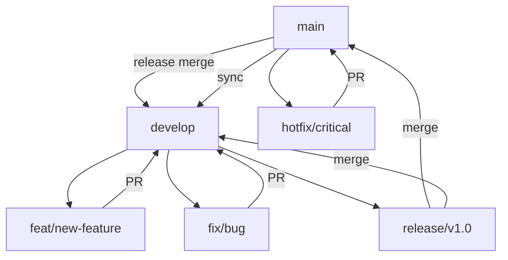

# Software Development Workflow Rules

This document outlines the comprehensive workflow guidelines for the cert-tree.rs project, incorporating industry best practices for Rust development, version control, testing, and release management. It merges general development processes with detailed Git workflow strategies based on an adapted Git Flow model (from nvie/gitflow) combined with GitHub Flow and Trunk-Based Development elements, suitable for small teams or solo development.

**Version:** 2.0 (Merged Git Workflow v1.0 on 2025-09-29)  
**Date:** 2025-09-29  

## Core Principles

### 1. Memory Bank First
- **Always read ALL memory bank files** at the start of every task
- Update memory bank files when significant changes occur
- Use memory bank as the single source of truth for project knowledge

### 2. Semantic Versioning
- Follow [semver rules](semver.md) for all version increments
- Update `Cargo.toml` version according to semver guidelines
- Update `CHANGELOG.md` with detailed release notes
- Use conventional commit messages with semver impact indicators

### 3. Commit Message Generation
- Use the [commit message generator](commit-message-generator-with-gitmojis.md) for all commits
- Generate conventional commit messages with gitmojis based on staged changes
- Follow the gitmoji ↔ conventional commits mapping for appropriate emoji and type selection
- Include scope when applicable (api, ui, auth, db, config, deps, docs)
- Keep descriptions imperative, concise, and under 50 characters
- Add body for complex changes explaining what and why
- Include breaking change footers when applicable

### 4. Justfile Automation
- Use justfile recipes for all repetitive development tasks
- Prefer justfile commands over manual CLI invocations
- Keep justfile updated with new workflows and recipes

## Development Workflow

### Daily Development Cycle

1. **Start of Day**
   ```bash
   just status          # Check git status
   just pull           # Pull latest changes
   just check          # Verify code compiles
   ```

2. **Code Changes**
   ```bash
   just build          # Build debug version
   just test           # Run test suite
   just fmt            # Format code
   just clippy         # Run linter
   ```

3. **Quality Assurance**
   ```bash
   just quality        # Full quality check (fmt + clippy + test + build)
   just run-test-cert  # Test with sample certificate
   ```

4. **End of Day**
   ```bash
   just status         # Review changes
   # Generate commit message using commit-message-generator-with-gitmojis.md
   just commit "<generated-message>"  # Commit with generated conventional message
   just push           # Push changes
   ```

### Feature Development

1. **Planning**
   - Read relevant memory bank files
   - Plan implementation in context.md
   - Identify affected files and components

2. **Implementation**
   ```bash
   just dev-check      # Quick development checks
   just test-verbose   # Run tests with output
   just run-test-cert-tui  # Test TUI functionality
   ```

3. **Code Review**
   - Self-review code changes
   - Run full quality suite: `just quality-release`
   - Test edge cases and error conditions

4. **Documentation**
   - Update inline code documentation
   - Update README.md if user-facing changes
   - Update memory bank files

## Code Quality Standards

### Rust Best Practices

1. **Memory Safety**
   - Leverage Rust's ownership system
   - Avoid unsafe code unless absolutely necessary
   - Use references over owned values when possible

2. **Performance**
   - Follow [Rust performance guidelines](rust-performance-guidelines.md)
   - Profile with `just profile`
   - Optimize hot paths identified by profiling

3. **Error Handling**
   - Use `Result<T, E>` for recoverable errors
   - Implement proper error types with `thiserror`
   - Provide meaningful error messages

### Code Style

1. **Formatting**
   - Use `rustfmt` via `just fmt`
   - Follow standard Rust formatting conventions

2. **Linting**
   - Run `clippy` via `just clippy`
   - Fix all warnings before committing
   - Configure clippy for project-specific rules

3. **Documentation**
   - Document public APIs with `///` comments
   - Use `cargo doc` via `just doc` to generate docs
   - Keep documentation up-to-date

## Testing Strategy

### Unit Testing

1. **Test Coverage**
   - Write unit tests for all public functions
   - Test edge cases and error conditions
   - Use `cargo test` via `just test`

2. **Test Organization**
   - Place unit tests in same file as implementation
   - Use descriptive test names
   - Test both success and failure paths

### Integration Testing

1. **CLI Testing**
   - Test command-line interface with various inputs
   - Verify help output: `just help`
   - Test with real certificate files

2. **Certificate Parsing**
   - Test with various certificate formats (PEM, DER)
   - Test certificate chain parsing
   - Verify error handling for malformed certificates

### Test Automation
```bash
just test            # Run all tests
just test-verbose    # Run tests with output
just run-test-cert   # Test with sample certificate
just run-test-cert-text  # Test text output mode
just run-test-cert-tui   # Test TUI mode
```

## Version Control

### Git Workflow Overview
These guidelines establish a consistent Git workflow using a hybrid approach based on Git Flow (adapted from nvie/gitflow) with elements of GitHub Flow and Trunk-Based Development. This balances structure with simplicity for small teams or solo development.

- **Main Branch**: Production-ready code (stable releases).
- **Develop Branch**: Ongoing development integration.
- **Short-lived Feature/Fix Branches**: For isolated work, merged via PRs.

This promotes clean history with conventional commits, peer review via PRs, protected branches, and semantic versioning for releases.

**Tools Assumed:** GitHub (with Actions for CI/CD), VS Code/Git CLI. Enforce via repository settings: Protect `main` and `develop` (require PRs, no direct pushes).

### Branching Strategy

#### Main Branch
- **Purpose**: Reserved for stable, production-ready code. Represents the latest release. Only merge completed, tested features/fixes via PRs after QA, reviews, and CI/CD success.
- **Rules**:
  - No direct pushes; all changes via PR from `develop` or hotfix branches.
  - Tagged with semantic versions (e.g., `v0.14.7`).
  - Never commit unfinished work or experiments here.
- **When to Use**: Post-release stabilization.

#### Develop Branch
- **Purpose**: Integration branch for all ongoing work. Acts as the "source of truth" for the latest development state. Daily commits, incremental changes, and non-production code go here.
- **Rules**:
  - Branch from `main` for new development cycles.
  - Merge feature/fix branches via PRs.
  - Prepare releases by branching from `develop`.
  - Rebase frequently to keep in sync with `main`.
- **When to Use**: Daily development; sync with `main` after releases.

#### Feature Branches (feat/*)
- **Purpose**: Implement new features without disrupting `develop`.
- **Naming**: `feat/<descriptive-name>` (e.g., `feat/crl-support`, `feat/tui-navigation`).
- **Workflow**:
  1. Branch from `develop`: `git checkout -b feat/user-authentication develop`.
  2. Commit with conventional messages.
  3. Implement, test locally (`cargo test`, `cargo clippy`).
  4. Push and create PR to `develop`.
  5. Merge via squash/rebase after review/CI.
  6. Delete branch post-merge: `git branch -d feat/user-authentication`.
- **Rules**: Short-lived (1-3 days); no merges into `main` directly.

#### Fix Branches (fix/*)
- **Purpose**: Bug fixes or hotfixes.
- **Naming**: `fix/<descriptive-name>` (e.g., `fix/login-crash`, `fix/memory-leak`).
- **Workflow**:
  - For non-urgent fixes: Branch from `develop`, merge to `develop`.
  - For production hotfixes: Branch from `main`, merge to `main`, then PR `main` → `develop` to sync.
  1. Branch: `git checkout -b fix/certificate-parsing develop` (or `main` for hotfix).
  2. Fix, test, commit.
  3. PR to target branch (`develop` or `main`).
  4. For hotfixes: After merging to `main`, create PR `main` → `develop`.
  5. Delete branch.
- **Rules**: Urgent fixes to `main` only if breaking production; otherwise, to `develop`.

#### Release Branches (release/*)
- **Purpose**: Stabilize code for release from `develop`.
- **Naming**: `release/v<major>.<minor>.<patch>` (e.g., `release/v0.14.0`).
- **Workflow**:
  1. Branch from `develop`: `git checkout -b release/v0.14.0 develop`.
  2. Update version in `Cargo.toml`, finalize changelog, fix minor issues.
  3. Tag and merge to `main`: `git checkout main; git merge --no-ff release/v0.14.0; git tag v0.14.0`.
  4. Merge back to `develop`: `git checkout develop; git merge --no-ff release/v0.14.0`.
  5. Delete branch.
- **Rules**: No new features; only bug fixes and metadata.

#### Other Branches
- **Hotfix**: Use `fix/*` from `main` for critical production issues.
- **Experimental**: Use personal forks/branches; never merge to protected branches without PR.

### Commit Standards
- Use the [commit message generator](commit-message-generator-with-gitmojis.md) to create conventional commits with gitmojis.
- Follow gitmoji ↔ conventional commits mapping for appropriate emoji and type selection.
- Include scope when applicable and keep descriptions imperative and concise.
- Reference issue numbers when applicable.
- Keep commits focused and atomic.

**Format**: `<type>[optional scope]: <description>`
- **Types**:
  - `feat`: New feature (e.g., `feat(tui): add navigation keys` → MINOR version).
  - `fix`: Bug fix (e.g., `fix(parser): handle malformed PEM` → PATCH).
  - `docs`: Documentation (no version bump).
  - `style`: Formatting (no bump).
  - `refactor`: Code changes without behavior shift (no bump).
  - `perf`: Performance improvements (PATCH).
  - `test`: Tests (no bump).
  - `chore`: Maintenance (e.g., `chore(deps): update x509-parser` → PATCH if breaking).
  - `BREAKING CHANGE`: In body/footer for major changes.
- **Examples**:
  ```
  feat(crl): implement revocation checking

  Add CRL distribution point extraction and status display.
  Resolves #42.
  ```
- **Tools**: Use `git commit` with templates or Husky/pre-commit hooks (add via Justfile if needed).

### Pull Requests
- **Mandatory**: All merges to `main`/`develop` via PRs. No direct pushes.
- **Process**:
  1. Create PR from feature/fix to target (e.g., `develop`).
  2. Link to issues: `Closes #123`.
  3. Include: Description, changes, testing instructions, screenshots if UI.
  4. Require: At least 1 approval, CI/CD pass (lint, tests, security via GitHub Actions).
  5. Options: Squash (clean history) or rebase+merge (preserve commits).
  6. Post-merge: Update `CHANGELOG.md`, delete source branch.
- **CI/CD Integration**: Use `.github/workflows/ci.yml` for:
  - `cargo check`, `cargo test`, `cargo clippy`.
  - Security: `cargo audit`.
  - Builds: Cross-compile for platforms.
- **Protected Branches**: In repo settings, enforce PRs, require status checks, dismiss stale approvals.

### Collaboration and Best Practices
- **Issues**: Use GitHub Issues for tasks/bugs. Label: `feature`, `bug`, `enhancement`.
- **Linking**: Reference issues in commits/PRs (e.g., `Fixes #42`).
- **Rebasing**: Regularly `git rebase develop` on feature branches to avoid conflicts.
- **Daily Workflow**:
  - `git pull origin develop` before starting.
  - Commit often, push frequently.
  - Resolve conflicts locally before PR.
- **Tools**:
  - GitHub/GitLab for PRs/issues.
  - VS Code GitLens for visualization.
  - `git log --graph` for history.
- **Team Size Adaptation**: For solo dev, simplify by skipping formal reviews but keep PRs for CI. For teams, require 2+ approvals.

### Examples

#### Basic Commands
```
# Start feature
git checkout develop
git pull origin develop
git checkout -b feat/new-extension develop

# Commit
git add .
git commit -m "feat(extensions): add OID mapping support"

# Push and PR
git push origin feat/new-extension
# Create PR on GitHub to develop

# Merge (after approval)
git checkout develop
git pull origin develop
git merge --no-ff feat/new-extension  # Or use GitHub UI

# Delete
git branch -d feat/new-extension
git push origin --delete feat/new-extension
```

#### Hotfix Example
```
# Production bug
git checkout main
git pull origin main
git checkout -b fix/critical-crash main

# Fix and commit
git commit -m "fix(security): patch buffer overflow"

# PR to main, merge, then:
git checkout develop
git pull origin develop
git merge main  # Or PR main -> develop
```

#### Branch Diagram (Mermaid)


**ASCII Alternative:**
```
main:     *----------------- v1.0 -----------------*
develop:  *--feat1--fix1--feat2--release/v1.0--*
feat1:         /--merge--\
hotfix:    *--fix--\                   /--sync--*
```

### Troubleshooting

#### Merge Conflicts
- **Cause**: Divergent changes.
- **Fix**:
  1. `git fetch origin`.
  2. `git rebase develop` (or target branch).
  3. Edit conflicted files, `git add .`.
  4. `git rebase --continue`.
  5. Force-push if needed: `git push --force-with-lease`.
- **Tip**: Use `git mergetool` or VS Code resolver.

#### Branch Divergence
- **Issue**: `develop` and `main` out of sync.
- **Fix**: After hotfix to `main`, PR `main` → `develop` and merge.

#### Large PRs
- **Avoid**: Break into smaller features.
- **Tip**: Use `git cherry-pick` for splitting.

#### Forgotten Rebase
- **Symptom**: Many conflicts in PR.
- **Fix**: Rebase source branch before final push.

#### Protected Branch Push Rejected
- **Fix**: Create PR instead of direct push.

### Onboarding and Training

#### For New Contributors
1. **Read This Doc**: Review branching, commits, PRs.
2. **Setup**:
   - Fork/clone repo: `git clone https://github.com/tdslot/cert-tree.rs.git`.
   - Add upstream: `git remote add upstream https://github.com/tdslot/cert-tree.rs.git`.
   - Protect local branches: Use `.gitconfig` aliases.
3. **First Contribution**:
   - Create issue or comment on existing.
   - Branch from `develop`, implement small fix.
   - Submit PR with details.
4. **Training Exercises**:
   - **Exercise 1**: Clone, create `feat/hello-world` branch, add a comment to `src/main.rs`, commit with `feat: add example comment`, PR to `develop`.
   - **Exercise 2**: Resolve a simulated conflict: Edit same line in two branches, merge via rebase.
   - **Exercise 3**: Tag a mock release: From `develop`, create `release/v0.1.0`, tag, merge to `main`.
5. **Resources**:
   - Git Flow Intro: https://nvie.com/posts/a-successful-git-branching-model/
   - Conventional Commits: https://www.conventionalcommits.org/
   - Atlassian Guide: https://www.atlassian.com/git/tutorials/comparing-workflows
   - Project-Specific: Review `CHANGELOG.md` for commit patterns.

#### Updates to Guidelines
- Version this doc (e.g., v2.1 for changes).
- Propose updates via PR to this file.
- Review quarterly or after major project changes.

**Questions?** Open an issue or ask in discussions.

### Git Automation
```bash
just status          # Check git status
just log            # View recent commits
# Use commit message generator for proper conventional commits with gitmojis
just commit "<generated-message>"  # Create commit with generated message
just push           # Push changes
just pull           # Pull changes
```

## Release Process

### Pre-Release Checklist

1. **Code Quality**
   ```bash
   just quality-release  # Full quality check for release
   just prepare-release  # Prepare for release
   ```

2. **Version Update**
   - Update version in `Cargo.toml` per semver rules
   - Update `CHANGELOG.md` with release notes
   - Commit version changes

3. **Testing**
   ```bash
   just run-test-cert-release  # Test release binary
   just version               # Verify version
   ```

### Release Steps

1. **Build Release**
   ```bash
   just build-release       # Build optimized binary
   just release-archive     # Create release archive
   just release            # Full release workflow
   ```

2. **Distribution**
   - Create git tag: `just tag v1.0.0 "Release v1.0.0"`
   - Upload release archive to GitHub Releases
   - Update documentation with new version

3. **Post-Release**
   - Update memory bank context.md
   - Announce release to community
   - Monitor for issues

**Git-Specific Release Integration**:
1. Finish features on `develop`.
2. Create `release/*` branch.
3. Stabilize: Run full tests, update version/docs.
4. Merge to `main`, tag: `git tag -a v0.14.0 -m "Release v0.14.0"`.
5. Merge to `develop`.
6. Push tags: `git push origin --tags`.
7. Automate via GitHub Actions (see `.kilocode/workflows/release-process.md` for details).
- **Versioning**: Follow semver (see `.kilocode/rules/semver.md`): MAJOR for breaks, MINOR for features, PATCH for fixes.

## Dependency Management

### Regular Maintenance

1. **Updates**
   ```bash
   just outdated        # Check for outdated dependencies
   just update-deps     # Update dependencies
   just audit          # Security audit
   ```

2. **Security**
   - Run security audits regularly
   - Update dependencies promptly for security fixes
   - Review dependency changes in PRs

## Documentation

### Types of Documentation

1. **Code Documentation**
   - Inline documentation with `///`
   - Function and struct documentation
   - Example usage in doc comments

2. **User Documentation**
   - README.md for installation and usage
   - CHANGELOG.md for version history
   - API documentation via `cargo doc`

3. **Internal Documentation**
   - Memory bank files for project knowledge
   - Workflow documentation (this file)
   - Architecture documentation

### Documentation Automation
```bash
just doc             # Generate and open documentation
just doc-build       # Generate documentation
just doc-check       # Check documentation
```

## Continuous Integration

### CI Pipeline

1. **Automated Checks**
   - Code formatting check
   - Linting with clippy
   - Unit and integration tests
   - Build verification

2. **Cross-Platform Testing**
   - Test on Linux, macOS, Windows
   - Use cross-compilation: `just build-all`

3. **Release Automation**
   - Automated release builds
   - Binary distribution
   - Documentation deployment

## Security Practices

### Code Security

1. **Input Validation**
   - Validate all user inputs
   - Handle malformed certificates gracefully
   - Use safe parsing libraries

2. **Dependency Security**
   ```bash
   just audit          # Regular security audits
   just outdated       # Check for vulnerable versions
   ```

3. **Memory Safety**
   - Rely on Rust's memory safety guarantees
   - Avoid unsafe code blocks
   - Regular code reviews for security

## Performance Monitoring

### Performance Guidelines

1. **Benchmarking**
   ```bash
   just bench          # Run benchmarks
   just profile        # Profile binary size and performance
   ```

2. **Optimization**
   - Profile before optimizing
   - Focus on hot paths
   - Measure improvements quantitatively

3. **Memory Usage**
   - Monitor memory consumption
   - Optimize data structures
   - Use efficient algorithms

## Team Collaboration

### Communication

1. **Code Reviews**
   - Review all changes before merging
   - Use constructive feedback
   - Share knowledge through reviews

2. **Knowledge Sharing**
   - Update memory bank with new learnings
   - Document complex implementations
   - Share best practices

3. **Issue Tracking**
   - Use GitHub issues for bugs and features
   - Reference issues in commits
   - Keep issues updated

## Emergency Procedures

### Rollback Process

1. **Identify Issue**
   - Monitor for critical bugs
   - Check user reports

2. **Rollback Steps**
   ```bash
   git revert <commit>   # Revert problematic commit
   just build-release    # Build fixed version
   just release         # Deploy hotfix
   ```

3. **Post-Mortem**
   - Analyze root cause
   - Update processes to prevent recurrence
   - Document lessons learned

## Tooling and Automation

### Essential Tools

1. **Development Tools**
   ```bash
   just setup           # Setup development environment
   just install-tools   # Install additional tools
   ```

2. **Environment Management**
   ```bash
   just env             # Show environment variables
   just sysinfo         # Show system information
   ```

3. **Backup and Recovery**
   ```bash
   just backup          # Create backup of important files
   just emergency-clean # Emergency cleanup
   ```

## Continuous Improvement

### Process Refinement

1. **Regular Reviews**
   - Review workflow effectiveness quarterly
   - Update processes based on lessons learned
   - Incorporate new best practices

2. **Tool Updates**
   - Keep development tools current
   - Update justfile with new recipes
   - Maintain CI/CD pipelines

3. **Knowledge Management**
   - Keep memory bank current
   - Document new patterns and practices
   - Share improvements with team

## Compliance and Standards

### Industry Standards

1. **Rust Ecosystem**
   - Follow Rust API guidelines
   - Use standard library patterns
   - Contribute to community crates

2. **Security Standards**
   - Follow OWASP guidelines
   - Implement secure coding practices
   - Regular security training

3. **Open Source**
   - Respect licenses
   - Follow contribution guidelines
   - Maintain professional standards

This workflow ensures consistent, high-quality development while leveraging automation through justfile recipes to streamline the development process.